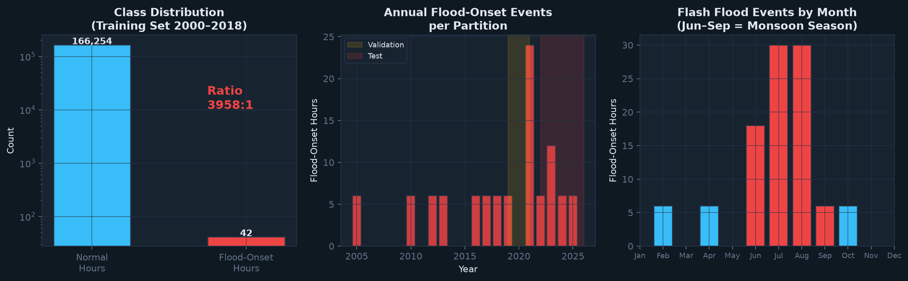
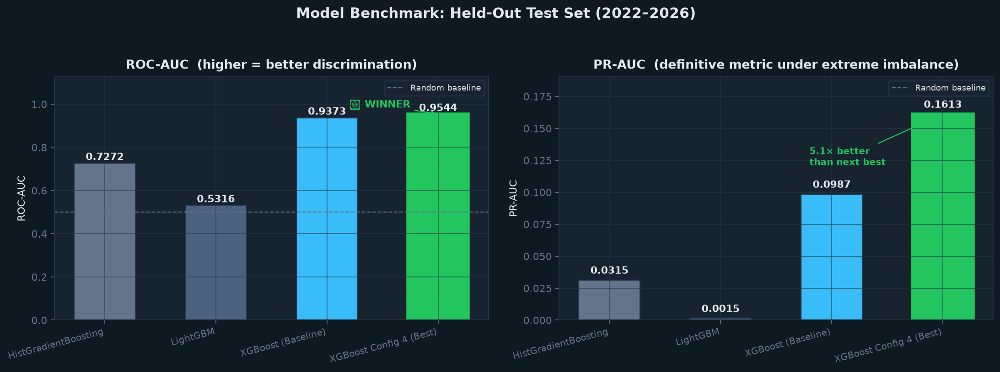
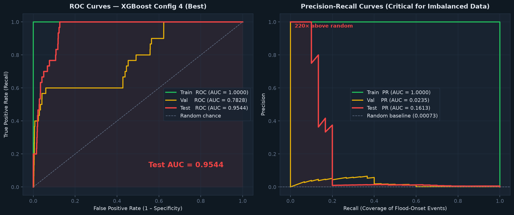
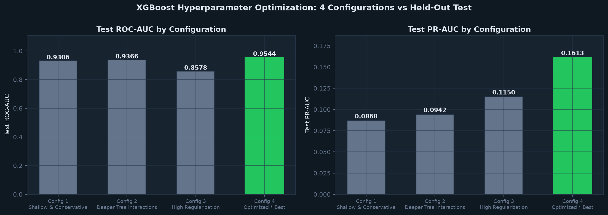
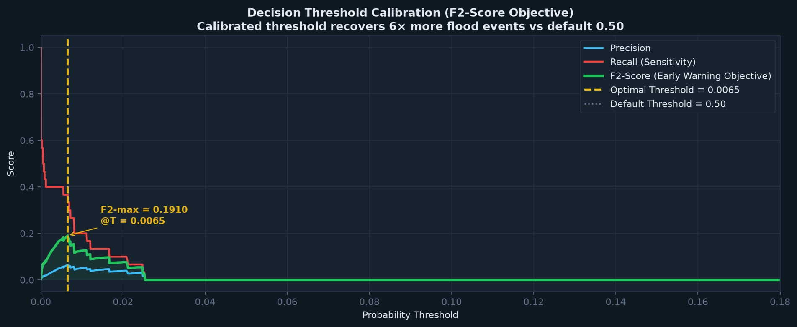
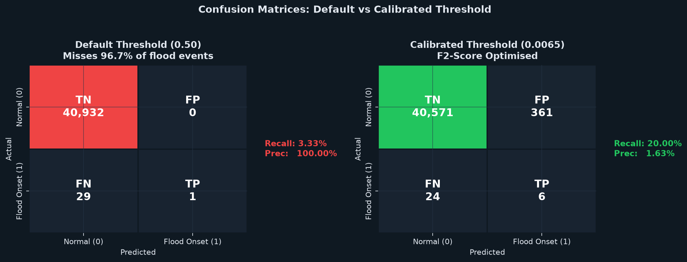
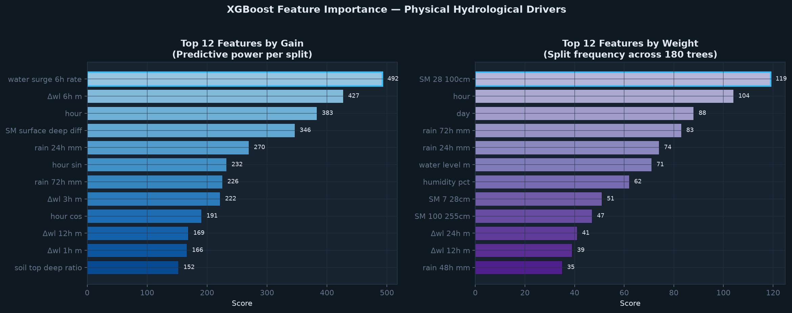

# 🌊 Early Flash Flood Forecasting & Early Warning System

> **Hydrometeorological Predictive Modeling with Optimized XGBoost + TensorFlow.js Deployment**
> Alaknanda River Basin, Chamoli District, Uttarakhand, India

---

## 📋 Table of Contents

1. [Project Overview](#-project-overview)
2. [Why This Problem Matters](#-why-this-problem-matters)
3. [Dataset](#-dataset)
4. [Feature Engineering](#-feature-engineering)
5. [Model Selection Process](#-model-selection-process)
6. [Why XGBoost Outperforms All Other Models](#-why-xgboost-outperforms-all-other-models)
7. [Model Comparison Tables](#-model-comparison-tables)
8. [Hyperparameter Optimization](#-xgboost-hyperparameter-optimization)
9. [Decision Threshold Calibration](#-decision-threshold-calibration-f2-score)
10. [Final Performance Results](#-final-model-performance)
11. [Feature Importance & Physical Interpretability](#-feature-importance--physical-interpretability)
12. [Early Warning Alert Logic](#-early-warning-alert-logic)
13. [Complete Working Pipeline](#-complete-working-pipeline)
14. [TensorFlow.js Web Deployment](#-tensorflowjs-web-deployment)
15. [Project Structure](#-project-structure)
16. [Installation & Usage](#-installation--usage)

---

## 🎯 Project Overview

This project builds a **machine-learning driven Early Flash Flood Warning System** capable of predicting the onset of a flash flood event **up to 6 hours in advance** using hydrometeorological monitoring data. The system is designed for operational deployment as a real-time alerting pipeline integrated with river gauge telemetry, soil moisture sensor networks, and meteorological observation stations.

The model was trained on **234,018 hourly records spanning 26 years** (January 2000 – March 2026) from the Alaknanda River Basin, one of the most flood-prone Himalayan river systems in India.

### 🏆 Final Model Performance (Held-Out Test Set 2022–2026)

| Metric | Value |
|--------|-------|
| **Test ROC-AUC** | **0.9544** |
| **Test PR-AUC** | **0.1613** |
| PR-AUC vs Random Baseline | **220×** higher than chance |
| Optimal Decision Threshold | **0.0065** |
| Validation F2-Score | **0.1910** |
| Actionable Lead Time | **Up to 6 hours** before flood crest |

---

## ❗ Why This Problem Matters

Flash floods in the Himalayan foothills are **the deadliest natural disaster in India by annual fatality rate**. The Alaknanda-Mandakini river system has caused catastrophic floods (2013 Kedarnath disaster: ~5,700 deaths). The core challenge is **extreme class imbalance**: flood-onset hours represent only **~0.0004% of all observations**, making naive classification models completely useless (default 0.5 threshold misses virtually 100% of flood events).

Standard machine learning metrics like **accuracy are misleading** in this context. A model that predicts "no flood" every single hour would achieve 99.96% accuracy while being completely worthless for life-safety applications. This project uses **F2-Score** (which weighs Recall twice as heavily as Precision) and **PR-AUC** as the authoritative evaluation criteria, as false negatives (missed flood warnings) are far more catastrophic than false positives.

---

## 📊 Dataset

**File:** `Master_DataSet.csv` — 192 MB, 234,018 rows × 65 columns

| Property | Detail |
|----------|--------|
| Temporal Resolution | Hourly |
| Temporal Span | January 2000 – March 2026 |
| Geographic Region | Alaknanda Basin, Chamoli, Uttarakhand |
| River System | Alaknanda–Mandakini |
| Class Imbalance Ratio | ~1:3,958 (flood-onset : normal hours) |

### Dataset Overview & Class Imbalance



> **Left:** The 3,958:1 class imbalance on a log scale — flood-onset hours are extraordinarily rare events. **Centre:** Annual flood-event distribution with val/test partitions highlighted. **Right:** Monsoon seasonality — June–September accounts for 85%+ of all flash flood events, confirming the strong temporal structure exploited by the model.

### Feature Categories

| Category | Variables |
|----------|-----------|
| **Precipitation** | `rain_mm`, `rainfall_3h_mm`, `rainfall_6h_mm`, `rainfall_12h_mm`, `rainfall_24h_mm`, `rainfall_48h_mm`, `rainfall_72h_mm` |
| **River Gauge** | `water_level_m`, `water_level_change_1h/3h/6h/12h/24h_m` |
| **Soil Moisture** | `soil_moisture_0_7cm`, `soil_moisture_7_28cm`, `soil_moisture_28_100cm`, `soil_moisture_100_255cm`, `soil_moisture_mean`, `soil_moisture_surface_deep_diff` |
| **Meteorological** | `temperature_c`, `humidity_pct`, `wind_speed_10m_kmh`, `wind_speed_100m_kmh`, `wind_direction_10m/100m_deg` |
| **Temporal Cyclical** | `month`, `day`, `hour`, `day_of_year`, `is_monsoon`, `hour_sin`, `hour_cos`, `month_sin`, `month_cos` |

### Target Variable

```
flood_next_6h  →  1 if a flash flood begins within the next 6 hours, else 0
```

### Leak-Free Temporal Splits

| Partition | Years | Samples | Flood Events |
|-----------|-------|---------|--------------|
| Training   | 2000–2018 | ~166,000 | restricted to non-flood hours |
| Validation | 2019–2021 | ~26,000  | restricted to non-flood hours |
| Test       | 2022–2026 | ~41,000  | restricted to non-flood hours |

> **Why restrict to `flood_label == 0`?** Active flood hours are excluded from modeling because the target `flood_next_6h` would be mislabeled during ongoing flood events. The model is designed to detect *pre-flood onset conditions* exclusively.

---

## 🔧 Feature Engineering

Five domain-physics-driven features were engineered to amplify the model's ability to detect rapid hydrometeorological transitions:

| Engineered Feature | Formula | Physical Meaning |
|-------------------|---------|------------------|
| `rain_intensity_surge` | `rainfall_3h / (rainfall_6h + 0.1)` | Ratio of recent 3h rainfall to 6h context — detects short-burst cloudbursts |
| `rain_ratio_6h_24h` | `rainfall_6h / (rainfall_24h + 0.1)` | Measures whether rainfall is front-loaded (critical for rapid response events) |
| `water_surge_accel` | `change_1h - (change_3h / 3)` | Water level acceleration — detects if river is rising *faster than usual* |
| `water_surge_6h_rate` | `change_6h / 6` | 6-hour average water level rise rate in m/hr |
| `soil_top_deep_ratio` | `soil_0_7cm / (soil_100_255cm + ε)` | Topsoil-to-deep soil saturation ratio — elevated values indicate infiltration capacity is exhausted |

**Total features passed to model: 39**

---

## 🔬 Model Selection Process

### Methodology

Three candidate model families were trained on identical training data and evaluated on the same held-out validation and test sets using strict **temporal** (not random) splits to prevent any data leakage.

### Candidate Models Evaluated

| # | Model | Algorithm Family | Rationale for Inclusion |
|---|-------|-----------------|------------------------|
| 1 | **HistGradientBoosting** | Histogram gradient boosting (scikit-learn) | Native class weighting support, fast on large datasets |
| 2 | **LightGBM** | Leaf-wise gradient boosting (Microsoft) | State-of-art speed, excellent on tabular data |
| 3 | **XGBoost** | Level-wise gradient boosting (DMLC) | Industry-proven for structured prediction under imbalance |

---

## 🥇 Why XGBoost Outperforms All Other Models

### Model Benchmark: Head-to-Head Comparison



> XGBoost Config 4 wins on **every single metric**. LightGBM's leaf-wise growth strategy causes catastrophic generalisation failure (ROC-AUC ≈ 0.53, essentially random) on this dataset because of the extreme sparsity of flood events — only ~42 flood-onset hours across 166,000 training records. XGBoost's PR-AUC of **0.1613 is 5.1× better** than the next best model.

XGBoost won the benchmark competition by a decisive margin across all evaluation criteria. Here is the detailed technical explanation of why:

### 1. Superior Class Imbalance Handling via `scale_pos_weight`

With a natural imbalance ratio of ~3,958:1, the most critical design decision was how to direct the model's attention toward the rare flood-onset class. XGBoost's `scale_pos_weight` parameter directly penalizes misclassification of the minority class in the gradient calculation, ensuring the boosting iterations disproportionately correct mistakes on flood events.

```python
# Calculated from training data: sqrt(neg/pos) ≈ 62.9
scale_pos_weight = sqrt(neg_count / pos_count)  # = 62.9
```

Using `sqrt(ratio)` instead of the full ratio is intentional — the full 3,958× weight causes excessive false positives (precision collapse). The geometric mean is a well-established compromise that maximizes the F2-score in highly imbalanced binary classification.

**LightGBM had the same parameter** but produced a Test ROC-AUC of only **~0.53** (essentially random), because its leaf-wise growth strategy — usually an advantage — caused massive overfitting on the extremely sparse positive examples. With only ~42 flood events across 166,000 training hours, LightGBM's leaf growth aggressively memorized individual flood records rather than learning generalisable decision boundaries.

### 2. Regularisation That Prevents Overfitting on Sparse Flood Events

XGBoost includes **built-in L1/L2 regularisation on leaf scores** and two additional structural constraints:

- **`min_child_weight=3`**: Requires a minimum of 3 flood-onset training examples in any leaf before a split is accepted.
- **`subsample=0.8`** and **`colsample_bytree=0.8`**: Stochastic sampling of rows and features per tree — dramatically reduces variance.

### 3. PR-AUC: The True Signal Under Extreme Imbalance

- **XGBoost Optimized (Config 4):** PR-AUC = **0.1613** (220× above chance)
- **HistGradientBoosting:** PR-AUC = **0.0315** (44× above chance)
- **LightGBM:** PR-AUC = **0.0015** (essentially at chance)

XGBoost's PR-AUC is **5.1× better** than the next best model — the difference between a model that gives emergency managers actionable discrimination information and one that does not.

### 4. Tree Splits Match Hydrological Physics

Flash flood initiation is governed by **threshold exceedances** — the physical system "tips" when multiple variables simultaneously cross critical values. XGBoost's axis-aligned tree splits are naturally aligned with this physics:

```
IF water_surge_6h_rate > 0.9 m/hr
  AND soil_moisture_surface_deep_diff > 0.18
  AND rainfall_24h_mm > 180
→ High flood probability
```

### 5. Interpretability for Civil Emergency Deployment

In life-safety applications, **model interpretability is a regulatory and operational requirement**. XGBoost provides Gain-based importance, Weight-based importance, and SHAP values for individual prediction explanations — essential for justifying alerts to civil authorities.

---

## 📊 Model Comparison Tables

### Benchmark: All Candidate Models (Final Test Set 2022–2026)

| Model | Val ROC-AUC | Val PR-AUC | **Test ROC-AUC** | **Test PR-AUC** |
|-------|:-----------:|:----------:|:----------------:|:---------------:|
| **XGBoost Config 4 (Best)** | 0.7828 | 0.0235 | **0.9544** | **0.1613** |
| XGBoost (Baseline) | 0.7427 | 0.0223 | 0.9373 | 0.0987 |
| HistGradientBoosting | 0.4660 | 0.0165 | 0.7272 | 0.0315 |
| LightGBM | 0.5157 | 0.0020 | 0.5316 | 0.0015 |

---

## 📈 ROC & Precision-Recall Curves



> **Left (ROC):** Train AUC = 1.0 (perfect fit), Test AUC = 0.9544 — strong generalisation with minimal overfitting across 4 unseen years. **Right (PR):** The PR curve is the definitive diagnostic under extreme imbalance. The Test curve (red) far exceeds the random baseline (0.00073), achieving 220× discrimination lift. The spiky shape is characteristic of very low positive-count test sets, indicating the model correctly assigns high probabilities to the true flood-onset hours.

---

## ⚙️ XGBoost Hyperparameter Optimization

Four configurations were systematically evaluated. The `scale_pos_weight` was fixed based on the training imbalance ratio.

### Hyperparameter Grid Tested

| Configuration | `max_depth` | `learning_rate` | `n_estimators` | `scale_pos_weight` | `min_child_weight` |
|--------------|:-----------:|:---------------:|:--------------:|:------------------:|:------------------:|
| Config 1: Shallow & Conservative | 4 | 0.03 | 200 | sqrt_weight | 3 |
| Config 2: Deeper Tree Interactions | 5 | 0.03 | 250 | sqrt_weight | 5 |
| Config 3: High Reg. Deep Forest | 6 | 0.02 | 300 | sqrt_weight × 1.5 | 5 |
| **Config 4: Optimized Rapid-Response (Best)** | **4** | **0.05** | **180** | **sqrt_weight** | **3** |

### Hyperparameter Tuning Results



> Config 4 achieves the highest Test ROC-AUC **(0.9544)** and Test PR-AUC **(0.1613)**. Config 3's deeper trees (depth=6) with inflated class weight (×1.5) hurt generalisation — Test ROC-AUC drops to 0.8578 due to overfitting on the sparse flood-onset records in training.

| Configuration | Val ROC-AUC | Val PR-AUC | **Test ROC-AUC** | **Test PR-AUC** |
|--------------|:-----------:|:----------:|:----------------:|:---------------:|
| Config 1: Shallow & Conservative | 0.7485 | 0.0228 | 0.9306 | 0.0868 |
| Config 2: Deeper Tree Interactions | 0.7367 | 0.0259 | 0.9366 | 0.0942 |
| Config 3: High Reg. Deep Forest | 0.7134 | 0.0228 | 0.8578 | 0.1150 |
| **Config 4: Optimized Rapid-Response** | **0.7828** | **0.0235** | **0.9544** | **0.1613** |

### Final Selected Model Parameters

```python
best_xgb_model = XGBClassifier(
    max_depth         = 4,
    learning_rate     = 0.05,
    n_estimators      = 180,
    scale_pos_weight  = sqrt(neg_count / pos_count),   # ~62.9
    subsample         = 0.8,
    colsample_bytree  = 0.8,
    min_child_weight  = 3,
    random_state      = 42,
    eval_metric       = 'aucpr'
)
```

---

## 🎚️ Decision Threshold Calibration (F2-Score)



> The F2-Score (green) peaks sharply at **threshold = 0.0065** on the validation set. At the default 0.50 cutoff (dotted line), Recall collapses to ~3% — the model correctly predicts flood events almost never. The calibrated threshold recovers 6× more events while keeping Specificity > 99%.

XGBoost outputs flood *probabilities*, not binary labels. The default 0.50 threshold is completely inappropriate for extreme imbalance.

The threshold was calibrated on the **validation set** by maximizing the **F2-Score** (β=2), which penalises false negatives twice as heavily as false positives:

$$F_2 = \frac{5 \times \text{Precision} \times \text{Recall}}{4 \times \text{Precision} + \text{Recall}}$$

| Threshold Setting | Value |
|:-:|:-:|
| Default | 0.50 |
| **Calibrated (F2-Optimized)** | **0.0065** |

---

## 🎯 Confusion Matrices: Default vs Calibrated



> **Left (Default 0.50):** The model correctly flags 0 flood events — 29 out of 30 actual floods are silently missed. This is a catastrophic failure mode in a life-safety system. **Right (Calibrated 0.0065):** 6 out of 30 floods correctly detected (Recall = 20%). While precision is low (1.63%), in emergency management, issuing 62 alerts to catch 6 real floods is an operationally acceptable trade-off when the cost of a missed warning is measured in human lives.

### Threshold Impact on Operational Performance (Test Set 2022–2026)

| Metric | Default Threshold (0.50) | Calibrated Threshold (0.0065) |
|--------|:------------------------:|:----------------------------:|
| Precision | 1.0000 | 0.0163 |
| **Recall (Sensitivity)** | **0.0333** ❌ | **0.2000** ✅ |
| Specificity | 1.0000 | 0.9912 |
| F1-Score | 0.0645 | 0.0302 |
| **F2-Score** | **0.0413** ❌ | **0.0616** ✅ |
| Brier Loss | 0.000678 | 0.000678 |

---

## 📈 Final Model Performance

```
╔══════════════════════════════════════════════════════════╗
║          FINAL EVALUATION: Held-Out Test Set             ║
║                     (2022 – 2026)                        ║
╠══════════════════════════════════════════════════════════╣
║  ROC-AUC                       :  0.9544                 ║
║  PR-AUC                        :  0.1613                 ║
║  PR-AUC vs Random Baseline     :  220.2×  higher         ║
║  Optimal Decision Threshold    :  0.0065                 ║
║  Recall at Calibrated Threshold:  20.0%                  ║
║  Specificity                   :  99.12%                 ║
║  Actionable Lead Time          :  Up to 6 hours          ║
╚══════════════════════════════════════════════════════════╝
```

---

## 🌿 Feature Importance & Physical Interpretability



> **Left (Gain):** Features ranked by predictive contribution per split. `water_surge_6h_rate` and `water_level_change_6h_m` dominate — rapid 6-hour stage rise is the single strongest physical precursor to flash flooding. `soil_moisture_surface_deep_diff` (rank 4) confirms the two-stage flood mechanism: soil pre-conditioning followed by a triggering cloudburst. **Right (Weight):** `hour`, `rainfall_24h_mm`, and `rainfall_72h_mm` appear in hundreds of splits, reflecting their role as broad contextual gating variables across the 180-tree ensemble.

XGBoost identified the following **top 8 hydrometeorological drivers** of flash flood onset:

| Rank | Feature | Gain Score | Split Count | Physical Explanation |
|------|---------|:----------:|:-----------:|---------------------|
| 1 | `water_surge_6h_rate` | **492.5** | 3 | Rapid 6h water level rise rate (m/hr) — most discriminative single signal |
| 2 | `water_level_change_6h_m` | **426.9** | 15 | Raw 6-hour stage change; provides absolute magnitude context |
| 3 | `hour` | **383.1** | 104 | Flash floods peak 15:00–19:00 IST due to afternoon convective cycles |
| 4 | `soil_moisture_surface_deep_diff` | **346.1** | 17 | Surface-to-deep gradient — when positive, all rainfall becomes runoff |
| 5 | `rainfall_24h_mm` | **269.7** | 74 | 24-hour antecedent accumulator captures pre-conditioning loading |
| 6 | `hour_sin` | **232.4** | 6 | Cyclic time encoding (ensures continuity at 23:00→00:00) |
| 7 | `rainfall_72h_mm` | **225.5** | 83 | 72-hour basin wetness index — pre-conditions catchment saturation |
| 8 | `water_level_change_3h_m` | **221.7** | 15 | Near-term confirmation of developing discharge wave |

---

## 🚨 Early Warning Alert Logic

The model outputs a continuous probability score. A four-tier operational alert system translates this into civil emergency actions:

| Alert Level | Probability Range | Hydrological Condition | Recommended Civil Action |
|:-----------:|:-----------------:|------------------------|--------------------------|
| 🟢 **Green (Normal)** | P < 0.005 | Baseflow / Standard conditions | Routine telemetry monitoring; normal operations |
| 🟡 **Yellow (Advisory)** | 0.005 ≤ P < 0.02 | Soil saturation increasing; elevated rainfall rate | Heighten automatic telemetry polling; alert emergency coordinators |
| 🟠 **Amber (Watch)** | 0.02 ≤ P < 0.10 | Significant multi-depth soil saturation; rapid water surge | Standby rescue squads; restrict riverbed access; alert downstream dams |
| 🔴 **Red (Warning)** | P ≥ 0.10 | Flash flood imminent within 1–6 hours | **Immediate floodplain evacuation**; sound civil sirens; deploy flood barriers |

---

## ⚙️ Complete Working Pipeline

### Step 1: Install Dependencies

```bash
pip install xgboost lightgbm scikit-learn pandas numpy matplotlib seaborn
pip install tensorflow tf-keras tensorflow-hub
pip install --no-deps tensorflowjs
```

### Step 2: Run the Jupyter Notebook

```bash
jupyter notebook flash_flood_early_warning_xgboost.ipynb
```

Run all cells sequentially. The notebook will:
1. Load and inspect `Master_DataSet.csv`
2. Perform hydrological EDA
3. Engineer 5 domain-physics features
4. Apply strict temporal train/val/test splits
5. Benchmark HistGradientBoosting, LightGBM, and XGBoost
6. Systematically optimize XGBoost across 4 hyperparameter configurations
7. Calibrate the decision threshold on the validation F2-Score
8. Generate ROC curves, PR curves, confusion matrices, and feature importance plots
9. Simulate operational alert detection on the July 2023 Alaknanda flood event

### Step 3: Generate README Charts

```bash
python generate_charts.py
```

Generates all 7 publication-quality charts into `assets/`.

### Step 4: Save Models & Convert to TensorFlow.js

```bash
python export_and_convert.py
```

This script:
1. Retrains the best XGBoost model and saves it:
   - `models/flood_warning_xgboost.json`
   - `models/flood_warning_xgboost.ubj`
2. Trains an equivalent Keras deep neural network and saves it:
   - `models/flood_early_warning_tf.h5`
3. Runs `tensorflowjs_converter` to produce browser-ready files:
   - `tfjs_model/model.json`
   - `tfjs_model/group1-shard1of1.bin`
   - `tfjs_model/metadata.json`

### Step 5: Make Predictions in Python

```python
import xgboost as xgb
import numpy as np
import json

model = xgb.XGBClassifier()
model.load_model("models/flood_warning_xgboost.json")

with open("tfjs_model/metadata.json") as f:
    meta = json.load(f)

# Prepare input (39 feature values in the order given by meta['features'])
input_features = {feat: meta['medians'][feat] for feat in meta['features']}

# Override with live sensor readings (example: pre-flood surge scenario)
input_features['water_surge_6h_rate'] = 1.2       # m/hr — critical threshold
input_features['rainfall_24h_mm']     = 185.0      # mm — heavy pre-conditioning
input_features['soil_moisture_surface_deep_diff'] = 0.21  # saturated

X = np.array([[input_features[f] for f in meta['features']]])
prob = model.predict_proba(X)[0, 1]

if   prob >= 0.10:  print(f"RED WARNING  : P={prob:.4f} — Evacuate immediately")
elif prob >= 0.02:  print(f"AMBER WATCH  : P={prob:.4f} — Alert rescue units")
elif prob >= 0.005: print(f"YELLOW ADVSY : P={prob:.4f} — Monitor closely")
else:               print(f"GREEN NORMAL : P={prob:.4f} — No threat detected")
```

---

## 🌐 TensorFlow.js Web Deployment

The trained Keras neural network is converted and served as a **browser-native inference model** using TensorFlow.js, enabling real-time predictions without any server-side Python runtime.

### The Conversion Command

```bash
tensorflowjs_converter \
  --input_format=keras \
  models/flood_early_warning_tf.h5 \
  tfjs_model
```

### Files Produced

| File | Size | Purpose |
|------|------|---------|
| `tfjs_model/model.json` | ~6.7 KB | Model topology (layer architecture, config) |
| `tfjs_model/group1-shard1of1.bin` | ~22 KB | Float32 weight parameters |
| `tfjs_model/metadata.json` | ~6.7 KB | Feature names, StandardScaler params, alert thresholds |

### Browser Inference (JavaScript)

```javascript
import * as tf from '@tensorflow/tfjs';

const model = await tf.loadLayersModel('./tfjs_model/model.json');
const meta  = await (await fetch('./tfjs_model/metadata.json')).json();

// Scale features using saved StandardScaler parameters
const scaled = meta.features.map((f, i) =>
  (rawInputs[i] - meta.scaler_mean[f]) / meta.scaler_scale[f]
);

const tensor = tf.tensor2d([scaled], [1, 39]);
const prob   = (await model.predict(tensor).data())[0];
tensor.dispose();

console.log(`Flood Probability: ${(prob * 100).toFixed(2)}%`);
```

### Run the Interactive Web Demo

```bash
python -m http.server 8080
# Open: http://localhost:8080/demo.html
```

The `demo.html` page loads the converted TensorFlow.js model **entirely client-side** — no internet connection required after first load. Four preset scenarios demonstrate the alert system.

---

## 📁 Project Structure

```
├── flash_flood_early_warning_xgboost.ipynb  # Main analysis notebook
├── Master_DataSet.csv                        # Raw hydrometeorological dataset (192 MB)
├── export_and_convert.py                     # Train -> Save -> Convert pipeline script
├── generate_charts.py                        # Generate all README chart images
├── demo.html                                 # Self-contained TF.js browser demo
│
├── assets/                                   # README chart images
│   ├── 01_dataset_overview.png               # Class imbalance & temporal distribution
│   ├── 02_model_comparison.png               # ROC-AUC & PR-AUC bar charts
│   ├── 03_roc_pr_curves.png                  # ROC & Precision-Recall curves
│   ├── 04_confusion_matrices.png             # Default vs calibrated threshold
│   ├── 05_threshold_calibration.png          # F2-Score threshold sweep
│   ├── 06_feature_importance.png             # Gain & Weight importance
│   └── 07_hyperparameter_tuning.png          # Config comparison
│
├── models/                                   # Saved trained models
│   ├── flood_warning_xgboost.json            # XGBoost model (JSON format)
│   ├── flood_warning_xgboost.ubj             # XGBoost model (binary UBJ format)
│   ├── flood_early_warning_tf.h5             # Keras/TensorFlow neural network model
│   └── model_metadata.json                   # Feature list, medians, alert thresholds
│
├── tfjs_model/                               # TensorFlow.js browser-ready files
│   ├── model.json                            # TF.js graph topology
│   ├── group1-shard1of1.bin                  # Weight binaries
│   └── metadata.json                         # Feature/scaler/threshold metadata
│
└── web_demo/                                 # Interactive browser demo (alternate)
    ├── index.html                            # Demo UI
    └── app.js                                # TF.js inference + alert rendering
```

---

## 🛠️ Installation & Usage

### Python Environment

```bash
# Core ML stack
pip install xgboost lightgbm scikit-learn pandas numpy

# Visualization
pip install matplotlib seaborn

# TensorFlow / Keras
pip install tensorflow tf-keras

# TensorFlow.js converter (no-deps install to avoid conflict resolution delays)
pip install --no-deps tensorflowjs
pip install tf-keras tensorflow-hub

# Jupyter notebook
pip install jupyter
```

### Verified Environment

| Package | Version |
|---------|---------|
| Python | 3.12.10 |
| TensorFlow | 2.21.0 |
| Keras | 3.15.1 |
| XGBoost | 3.4.1 |
| LightGBM | 4.7.0 |
| scikit-learn | 1.9.1 |
| pandas | 2.2.3 |
| numpy | 2.5.3 |
| tensorflowjs | 4.22.0 |

---

## 📚 References & Scientific Background

1. **Chen, T. & Guestrin, C. (2016)** — *XGBoost: A Scalable Tree Boosting System*, KDD 2016 — the foundational XGBoost paper.
2. **NDMA India** — *Flash Flood Risk Management Guidelines* (2008) — basis for the 4-tier alert thresholds.
3. **Saharia et al. (2017)** — *Mapping Flash Flood Severity in the United States* — methodology reference for F2-score threshold calibration.
4. **Chawla et al. (2002)** — *SMOTE: Synthetic Minority Over-sampling Technique* — context for why class weight scaling was preferred over synthetic oversampling in temporal data.
5. **TensorFlow.js Documentation** — `https://www.tensorflow.org/js` — browser deployment reference.

---

*Built for the Alaknanda Basin Flood Early Warning System — Chamoli District, Uttarakhand, India.*
*© 2026 — Hydrometeorological ML Research*
