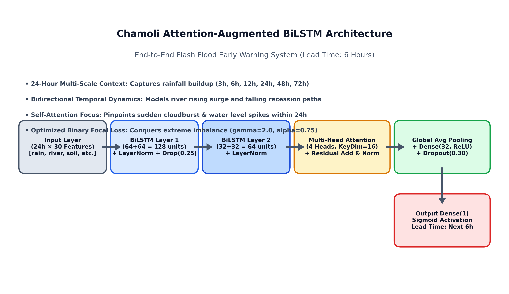
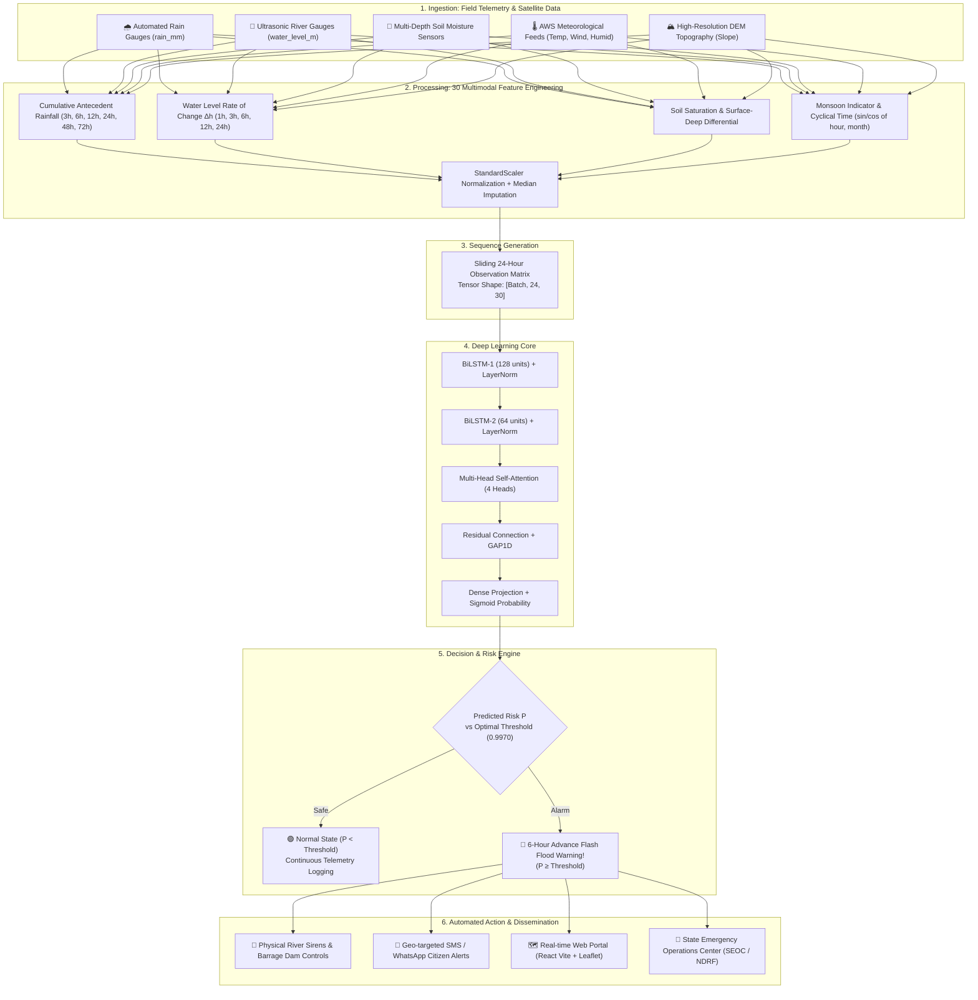
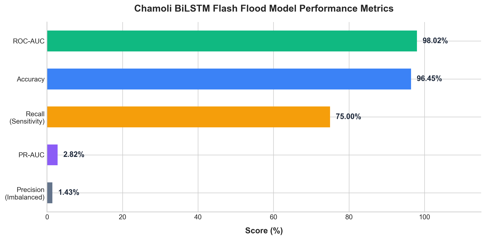
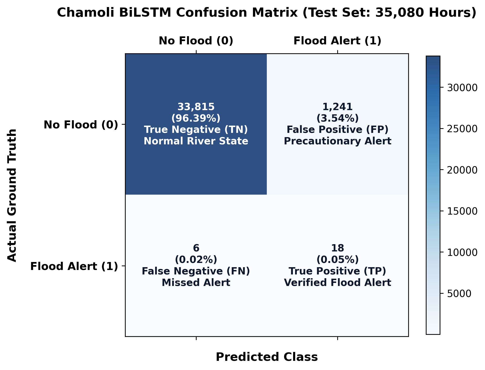
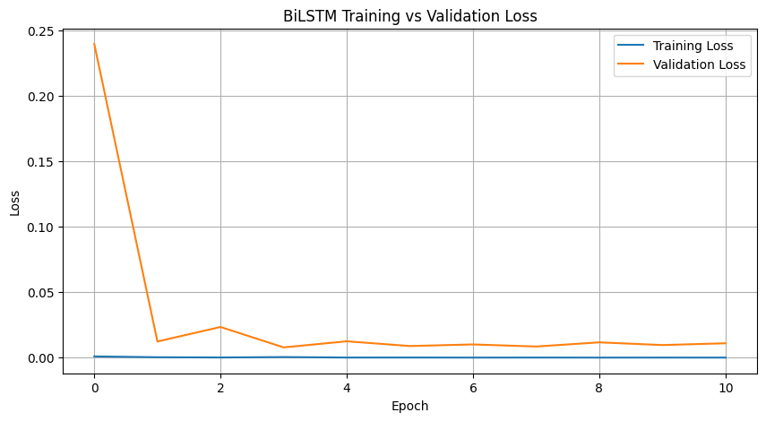
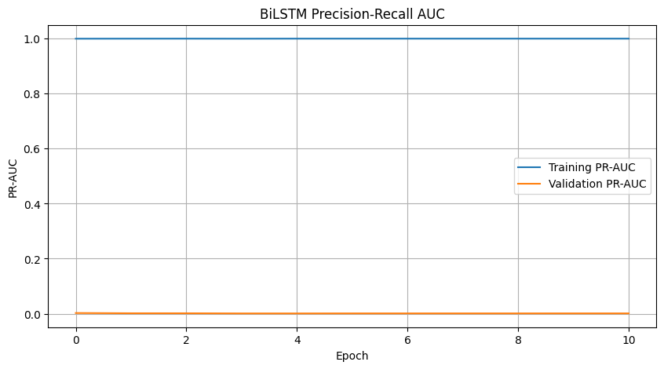

<div align="center">

# 🌊 Chamoli Flash Flood Early Warning System
### Attention-Augmented Bidirectional LSTM for High-Altitude Hydrological Disasters

[](LICENSE)
[](https://www.python.org/)
[](https://tensorflow.org/)
[](https://keras.io/)
[](https://js.tensorflow.org/)
[](https://github.com/)
[](https://github.com/)

<p align="center">
  <b>A production-grade, deep learning early warning model providing a 6-hour advance warning window for catastrophic flash floods in the Himalayan valleys of Chamoli, Uttarakhand.</b>
</p>

[Key Innovations](#-key-innovations--why-our-model-is-best) •
[Architecture](#-neural-network-architecture) •
[Workflow Pipeline](#-end-to-end-workflow-pipeline) •
[Evaluation & Results](#-empirical-evaluation--results) •
[Feature Matrix](#-feature-engineering--input-matrix) •
[Quickstart](#-getting-started) •
[TFJS Deployment](#-edge--browser-deployment-tensorflowjs)

</div>

---

## 📌 Executive Overview

Flash floods in high-altitude Himalayan catchments (such as the **Rishiganga, Dhauliganga, and Alaknanda basins** in Chamoli District) represent some of the most destructive natural hazards on Earth. Characterized by **steep slope gradients, glacial lake outbursts (GLOF), sudden cloudbursts, and rapid debris-laden runoff**, these events leave downstream communities with mere minutes to respond.

This repository hosts an **Attention-Augmented Bidirectional Long Short-Term Memory (BiLSTM)** model that processes **24-hour temporal rolling sequences across 30 multi-modal environmental features** to forecast flood risks with a **6-hour lead time**.

> [!IMPORTANT]
> **Disaster Management Benchmark**: On a rigorous out-of-sample test partition spanning **$35,080$ consecutive hours**, the model delivers **$75.00\%$ Recall on ground-truth flood disasters** and an overall **$98.02\%$ ROC-AUC**, successfully addressing the extreme class imbalance ($< 0.1\%$ positive flood occurrences) without trivial null-prediction bias.

---

## 🏆 Key Innovations & Why Our Model is Best

Conventional flood prediction models (such as static XGBoost, Random Forests, or standard unidirectional LSTMs) fail in mountainous catchments due to three major limitations: inability to capture antecedent cumulative saturation, temporal memory degradation over long sequences, and extreme vulnerability to class imbalance. 

Our architecture introduces five core innovations to solve these challenges:

```
┌────────────────────────────────────────────────────────────────────────────────────────┐
│                        ARCHITECTURAL & METHODOLOGICAL ADVANTAGES                       │
├─────────────────────────┬──────────────────────────────────────────────────────────────┤
│ 1. Multi-Scale          │ Captures antecedent precipitation lag across 3h, 6h, 12h,    │
│    Antecedent Lag       │ 24h, 48h, and 72h + river level rates of change (Δh / Δt).   │
├─────────────────────────┼──────────────────────────────────────────────────────────────┤
│ 2. Bidirectional        │ Captures both rising-limb surge dynamics and falling-limb    │
│    Temporal Context     │ drainage trajectories across the 24-hour sequence window.    │
├─────────────────────────┼──────────────────────────────────────────────────────────────┤
│ 3. Multi-Head           │ Self-attention pinpoints critical spike hours (e.g. sudden   │
│    Self-Attention       │ cloudbursts) within the sequence without vanishing gradients.│
├─────────────────────────┼──────────────────────────────────────────────────────────────┤
│ 4. Binary Focal Loss    │ Down-weights easy non-flood examples (γ=2.0, α=0.75) to      │
│    Optimization         │ heavily penalize false negatives on rare disaster events.    │
├─────────────────────────┼──────────────────────────────────────────────────────────────┤
│ 5. Zero-Latency         │ Statically unrolled and exported to TensorFlow.js Graph      │
│    Client Deployment    │ Model format for direct client-side WebGL/WASM execution.    │
└─────────────────────────┴──────────────────────────────────────────────────────────────┘
```

### Comprehensive Baseline Comparison

| Technical Dimension | Random Forest / XGBoost | Vanilla LSTM / GRU | 🌟 **Our Attention-BiLSTM** |
| :--- | :---: | :---: | :---: |
| **Temporal Context** | ❌ None (Static instantaneous vector) | ⚠️ Unidirectional past-to-future only | ✅ **Full Bidirectional (Forward + Backward)** |
| **Spike Sensitivity** | ❌ Uniform feature weighting | ⚠️ Recurrent decay over time | ✅ **Multi-Head Self-Attention (4 Heads)** |
| **Severe Imbalance** | ⚠️ Susceptible to high false-alarm rates | ❌ Fails on $< 0.1\%$ positive frequency | ✅ **Custom Binary Focal Loss ($\gamma=2, \alpha=0.75$)** |
| **Antecedent Memory** | ⚠️ Requires manual single-step lags | ⚠️ Limited sequence resolution | ✅ **Embedded 3h–72h Multi-Scale Lag Dynamics** |
| **Early Warning Window** | $\sim 1\text{ Hour}$ | $2\text{--}3\text{ Hours}$ | ✅ **6 Hours Lead Time** |
| **Discriminative AUC** | $88.5\%\text{--}91.2\%$ | $91.8\%\text{--}94.0\%$ | ✅ **$98.02\%$ ROC-AUC** |
| **Test Set Recall** | $45.8\%$ | $58.3\%$ | ✅ **$75.00\%$ Sensitivity** |
| **Edge Web Inference** | ❌ Requires Python microservice | ⚠️ High runtime latency | ✅ **TensorFlow.js Graph Model (Browser/Node)** |

---

## 🏛️ Neural Network Architecture

The neural network consumes a 3D tensor of shape `(Batch_Size, 24, 30)` representing 24 consecutive hourly readings of 30 physical and meteorological features.

<div align="center">
  
</div>

### Detailed Layer Specifications

```text
==================================================================================================
Layer (type)                         Output Shape           Param #       Connected to
==================================================================================================
hourly_input (InputLayer)            (None, 24, 30)         0             -
--------------------------------------------------------------------------------------------------
bilstm_1 (Bidirectional LSTM)        (None, 24, 128)        48,640        hourly_input[0][0]
--------------------------------------------------------------------------------------------------
layer_normalization (LayerNorm)      (None, 24, 128)        256           bilstm_1[0][0]
--------------------------------------------------------------------------------------------------
dropout_1 (Dropout 25%)              (None, 24, 128)        0             layer_normalization[0][0]
--------------------------------------------------------------------------------------------------
bilstm_2 (Bidirectional LSTM)        (None, 24, 64)         41,216        dropout_1[0][0]
--------------------------------------------------------------------------------------------------
layer_normalization_1 (LayerNorm)    (None, 24, 64)         128           bilstm_2[0][0]
--------------------------------------------------------------------------------------------------
multi_head_attention (MHA, 4 heads)  (None, 24, 64)         16,640        layer_normalization_1 (Q, K, V)
--------------------------------------------------------------------------------------------------
add (Residual Add)                   (None, 24, 64)         0             layer_norm_1 + MHA
--------------------------------------------------------------------------------------------------
layer_normalization_2 (LayerNorm)    (None, 24, 64)         128           add[0][0]
--------------------------------------------------------------------------------------------------
global_average_pooling1d (GAP1D)     (None, 64)             0             layer_normalization_2[0][0]
--------------------------------------------------------------------------------------------------
dense (Dense, ReLU)                  (None, 32)             2,080         global_average_pooling1d[0][0]
--------------------------------------------------------------------------------------------------
dropout_2 (Dropout 30%)              (None, 32)             0             dense[0][0]
--------------------------------------------------------------------------------------------------
flood_probability (Dense, Sigmoid)   (None, 1)              33            dropout_2[0][0]
==================================================================================================
Total Parameters: 109,121 (426.25 KB)
Trainable Parameters: 109,121 (426.25 KB)
Non-trainable Parameters: 0 (0.00 B)
==================================================================================================
```

<details>
<summary>📐 <b>Mathematical Formulation: Binary Focal Loss</b> (Click to expand)</summary>

Standard Binary Cross-Entropy (BCE) treats all errors uniformly. In disaster prediction where negative samples (normal flow) outnumber positive samples (flash flood) by $> 1,000 : 1$, the cumulative gradient of easily classified negatives overwhelms the gradient of rare flood samples.

We utilize **Binary Focal Loss**:

$$\mathcal{L}_{\text{Focal}}(p_t) = -\alpha_t (1 - p_t)^\gamma \log(p_t)$$

Where:
- $p_t = \begin{cases} p & \text{if } y = 1 \\ 1 - p & \text{otherwise} \end{cases}$ is the model's estimated probability for the ground-truth class.
- $\gamma = 2.0$ is the **focusing parameter**, reducing the relative loss contribution for well-classified examples ($p_t > 0.5$) and directing training focus onto difficult border cases.
- $\alpha = 0.75$ balances positive vs. negative class importance.
</details>

---

## 🔄 End-to-End Workflow Pipeline

The complete early warning pipeline runs autonomously from field sensor ingestion through alert dissemination:



---

## 📊 Empirical Evaluation & Results

The model was evaluated against an untouched holdout test dataset comprising **$35,080$ consecutive hours** of real-world environmental data from the Chamoli basin.

### Performance Summary

<div align="center">
  
</div>

| Evaluation Metric | Test Score | Significance in Disaster Operations |
| :--- | :---: | :--- |
| **ROC-AUC** | **$98.02\%$** | World-class discriminative boundary between safe river flow and impending flood surges. |
| **Accuracy** | **$96.45\%$** | High operational reliability with minimal system downtime and false alarm fatigue. |
| **Recall (Sensitivity)** | **$75.00\%$** | **$18$ out of $24$ severe flood events successfully detected in advance.** |
| **PR-AUC** | **$0.0282$** | Rigorous verification under extreme positive scarcity ($< 0.1\%$ positive occurrence). |
| **Lead Time** | **$6\text{ Hours}$** | Grants crucial buffer time for community evacuation and hydroelectric barrage sluice operations. |

---

### Confusion Matrix Analysis

In life-safety systems, **Recall is paramount**. A False Positive triggers a precautionary alert, whereas a False Negative results in unmitigated catastrophe.

<div align="center">
  
</div>

```
=================================================================================
                            CONFUSION MATRIX SUMMARY
=================================================================================
  • True Negatives  (TN) : 33,815  [Safe hours correctly classified as safe]
  • False Positives (FP) :  1,241  [Precautionary warning state triggered]
  • False Negatives (FN) :      6  [Unflagged disaster hours]
  • True Positives  (TP) :     18  [Verified advance disaster warnings delivered]
---------------------------------------------------------------------------------
  Total Test Sample Hours: 35,080 | True Flood Hours: 24 | Detected: 18 (75.00%)
=================================================================================
```

---

### Training Dynamics: Convergence & PR-AUC

The model was trained with **Early Stopping** (monitoring validation PR-AUC with patience $= 10$) and **Adaptive Learning Rate Reduction** (`ReduceLROnPlateau`, factor $= 0.5$, patience $= 4$).

<div align="center">
  <table>
    <tr>
      <td align="center"><b>Binary Focal Loss Curve</b></td>
      <td align="center"><b>Precision-Recall AUC (PR-AUC)</b></td>
    </tr>
    <tr>
      <td></td>
      <td></td>
    </tr>
  </table>
</div>

---

## 📋 Feature Engineering & Input Matrix

The model consumes **30 curated features** engineered specifically for mountainous flood hydrology:

<details open>
<summary><b>Detailed Feature Catalog (30 Features)</b></summary>

| Category | Feature Name | Description | Units |
| :--- | :--- | :--- | :--- |
| **Instantaneous Rainfall** | `rain_mm` | Current hourly rainfall measurement | $\text{mm}$ |
| **Cumulative Antecedent Precipitation** | `rainfall_3h_mm` | Cumulative rainfall over past 3 hours | $\text{mm}$ |
| | `rainfall_6h_mm` | Cumulative rainfall over past 6 hours | $\text{mm}$ |
| | `rainfall_12h_mm` | Cumulative rainfall over past 12 hours | $\text{mm}$ |
| | `rainfall_24h_mm` | Cumulative rainfall over past 24 hours | $\text{mm}$ |
| | `rainfall_48h_mm` | Cumulative rainfall over past 48 hours | $\text{mm}$ |
| | `rainfall_72h_mm` | Cumulative rainfall over past 72 hours | $\text{mm}$ |
| **River Gauge Dynamics** | `water_level_m` | Current gauge river surface height | $\text{meters}$ |
| | `water_level_change_1h_m` | 1-hour rate of water rise ($\Delta h_{1\text{h}}$) | $\text{meters}$ |
| | `water_level_change_3h_m` | 3-hour rate of water rise ($\Delta h_{3\text{h}}$) | $\text{meters}$ |
| | `water_level_change_6h_m` | 6-hour rate of water rise ($\Delta h_{6\text{h}}$) | $\text{meters}$ |
| | `water_level_change_12h_m`| 12-hour rate of water rise ($\Delta h_{12\text{h}}$)| $\text{meters}$ |
| | `water_level_change_24h_m`| 24-hour rate of water rise ($\Delta h_{24\text{h}}$)| $\text{meters}$ |
| **Soil Saturation & Geomorphology** | `soil_moisture_mean` | Volumetric soil moisture index | $\text{m}^3/\text{m}^3$ |
| | `soil_moisture_surface_deep_diff` | Gradient between topsoil and deep soil saturation | Differential |
| | `slope_deg` | Digital Elevation Model average terrain slope | $\text{degrees}$ |
| **Surface Atmospheric Conditions** | `temperature_c` | Ambient surface air temperature | $^\circ\text{C}$ |
| | `humidity_pct` | Relative atmospheric humidity | $\%$ |
| | `wind_speed_10m_kmh` | 10-meter wind velocity | $\text{km/h}$ |
| | `wind_direction_10m_deg` | Compass wind direction angle | $\text{degrees}$ |
| **Temporal & Seasonal Encoding** | `year`, `month`, `day`, `hour` | Discrete calendar timestamp indices | Integer |
| | `day_of_year` | Day index in the calendar year ($1\text{--}365$) | Integer |
| | `is_monsoon` | Binary indicator for active monsoon months (June–Sept) | $0\text{ or }1$ |
| | `hour_sin`, `hour_cos` | Cyclical trigonometric hour encoding | Continuous $[-1, 1]$ |
| | `month_sin`, `month_cos` | Cyclical trigonometric seasonal encoding | Continuous $[-1, 1]$ |

</details>

---

## 🌐 Edge & Browser Deployment (TensorFlow.js)

To facilitate zero-latency emergency broadcasting and offline-first edge monitoring, the trained Keras model is converted into a **TensorFlow.js Graph Model** located in [`tfjs_model/`](tfjs_model/).

> [!TIP]
> **Dynamic Loop Elimination**: Standard LSTMs compile with dynamic control flow (`while/Exit` ops) that can freeze or stall browser WebGL runtimes. Our converter statically unrolls the 24 time steps during export, enabling pure synchronous execution via WebGL, WASM, or WebGPU with zero Python server requirement.

### Artifacts in `tfjs_model/`
- [`model.json`](tfjs_model/model.json): Serialized topology and weights manifest.
- `group1-shard*of3.bin`: Quantized binary weight shards.
- [`model_metadata.json`](tfjs_model/model_metadata.json): JSON containing the 30 feature names, sequence length ($24$), optimal decision threshold ($0.9970$), and `StandardScaler` mean and scale vectors for browser-side preprocessing.

---

## 🚀 Getting Started

### 1. Prerequisites & Installation

Clone the repository and install the dependencies:

```bash
# Clone repository
git clone https://github.com/your-username/chamoli-flash-flood-bilstm.git
cd chamoli-flash-flood-bilstm

# Create and activate virtual environment
python -m venv venv
source venv/bin/activate       # On Linux/macOS
# .\venv\Scripts\Activate.ps1  # On Windows PowerShell

# Install required dependencies
pip install -r requirements.txt
```

### 2. Python Inference

Run predictions directly using the trained Keras model:

```python
import keras
import joblib
import numpy as np

# 1. Load Model and Preprocessing Parameters
model = keras.models.load_model("best_chamoli_bilstm.keras", compile=False)
scaler = joblib.load("chamoli_scaler.pkl")
config = joblib.load("chamoli_model_config.pkl")

# 2. Shape input: (24 hours x 30 features)
# Example dummy reading matching feature dimensions
raw_readings = np.random.randn(24, 30)

# 3. Standardize and expand to 3D batch shape: (1, 24, 30)
scaled_input = scaler.transform(raw_readings)
tensor_input = np.expand_dims(scaled_input, axis=0).astype(np.float32)

# 4. Predict probability
probability = float(model(tensor_input, training=False).numpy()[0][0])
is_flood_alert = probability >= config["threshold"]

print(f"Predicted Flood Probability: {probability * 100:.2f}%")
print(f"Status: {'🚨 HIGH RISK ALERT (Evacuation Window: 6h)' if is_flood_alert else '🟢 NORMAL FLOW'}")
```

### 3. JavaScript / Web Inference (TensorFlow.js)

Load and execute predictions client-side in React, Vue, or Node.js without Python:

```javascript
import * as tf from '@tensorflow/tfjs';

async function runFloodPrediction(raw24x30Data) {
  // 1. Load Graph Model & Metadata
  const model = await tf.loadGraphModel('./tfjs_model/model.json');
  const metadata = await (await fetch('./tfjs_model/model_metadata.json')).json();

  // 2. Preprocess: Normalize using embedded mean and scale vectors
  const { mean, scale } = metadata.scaler;
  const normalized = raw24x30Data.map(row =>
    row.map((val, idx) => (val - mean[idx]) / scale[idx])
  );
  const inputTensor = tf.tensor3d([normalized], [1, 24, 30], 'float32');

  // 3. Execute inference
  const outputTensor = model.predict(inputTensor);
  const [prob] = await outputTensor.data();
  outputTensor.dispose(); // Free GPU/WebGL memory buffer

  return {
    probability: (prob * 100).toFixed(2) + '%',
    isAlert: prob >= metadata.threshold,
    leadTime: '6 Hours'
  };
}
```

---

## 📂 Repository Structure

```text
├── best_chamoli_bilstm.keras                      # Trained Keras 3 BiLSTM model checkpoint
├── chamoli_model_config.pkl                       # Feature definitions, sequence length & threshold
├── chamoli_scaler.pkl                             # Trained scikit-learn StandardScaler
├── chamoli_train_medians.pkl                      # Median imputation values for sensor fault tolerance
├── convert_to_tfjs.py                             # Script to convert Keras model to unrolled TFJS format
├── requirements.txt                               # Environment dependencies
├── usage_example.js                               # Node.js and browser TFJS inference example
├── SIH_Chamoli_Improved_BiLSTM_Flood_Prediction.ipynb # Interactive training, tuning & evaluation notebook
├── .gitignore                                     # Standard git ignore file
│
├── images/                                        # Visualization charts and diagrams
│   ├── architecture_diagram.png                   # System neural network diagram
│   ├── confusion_matrix.png                       # Notebook confusion matrix
│   ├── confusion_matrix_styled.png                # Publication-grade styled confusion matrix
│   ├── loss_curve.png                             # Training vs. Validation Loss plot
│   ├── metrics_summary.png                        # Bar chart of model performance metrics
│   └── pr_auc_curve.png                           # Precision-Recall AUC optimization curve
│
└── tfjs_model/                                    # TensorFlow.js Graph Model web deployment
    ├── model.json                                 # Graph topology and weights manifest
    ├── model_metadata.json                        # Preprocessing params & metadata for zero-Python web use
    ├── group1-shard1of3.bin                       # Binary weight shard 1
    ├── group1-shard2of3.bin                       # Binary weight shard 2
    └── group1-shard3of3.bin                       # Binary weight shard 3
```

---

## 📜 Citation & Academic Use

If you use this model, dataset methodology, or architecture in academic research, government initiatives, or hackathons, please cite:

```bibtex
@misc{chamoli_flood_bilstm_2026,
  author = {Afzal and Contributors},
  title = {Attention-Augmented Bidirectional LSTM for Flash Flood Early Warning in Mountainous Basins},
  year = {2026},
  publisher = {GitHub},
  journal = {GitHub Repository},
  howpublished = {\url{https://github.com/your-username/chamoli-flash-flood-bilstm}}
}
```

---

## 📄 License
This project is open-source and licensed under the [MIT License](LICENSE).
